# About 

devtime is an application that helps you track how much time you spend working on your projects. It uses SQLite to store the logs for each day.

devtime favors UX over UI and tries not to get in the way of the user while still offering a lot of control. It was created by developers, for developers.

  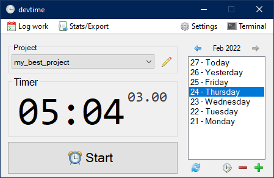

- [Usage](#usage)
  - [Creating a project](#creating-a-project)
  - [Using the timer](#using-the-timer)
  - [Logging work](#logging-work)
  - [Navigating the days list](#navigating-the-days-list)
  - [Manually adding a day](#manually-adding-a-day)
  - [Changing the logged time for a day](#changing-the-logged-time-for-a-day)
  - [Refreshing everything](#refreshing-everything)
  - [Stats](#stats)
    - [Exporting to CSV/JSON](#exporting-to-csvjson)
  - [Settings](#settings)
    - [Database](#database)
    - [Taskbar/Tray](#taskbar-tray)
    - [Hotkeys](#hotkeys)
    - [Advanced](#advanced)
  - [Terminal](#terminal)
- [Building devtime](#building-devtime)
- [License](#license-)
  - [Dependencies and assets](#dependencies-and-assets)

# Usage

If it's your first time using devtime, you need to create your first project.

## Creating a project

  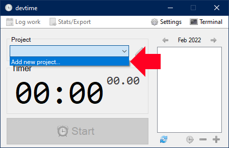

  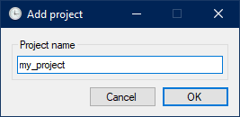

The name must be alphascore (`a-zA-Z0-9_`), and the first character cannot be a digit.

You can create multiple projects.

## Using the timer

When you want to work, simply click *Start*. Make sure you selected the project that you're currently working on.

  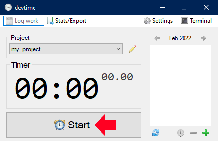

When you want to take a break or stop working, press *Stop*. You may press *Start* and *Stop* at any time, for as many times.

  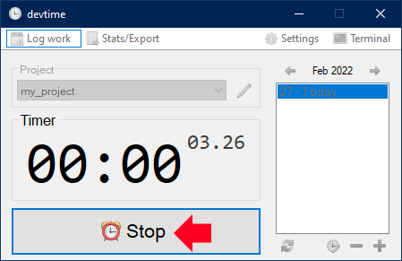

devtime will automatically create an entry for the current day if it doesn't exist.

## Logging work

At the end of the day (or at any time) you can press *Log Work* to write a description of what you did on that day. This is fully optional. If you haven't written a log for a given day, you'll see a small warning icon.

  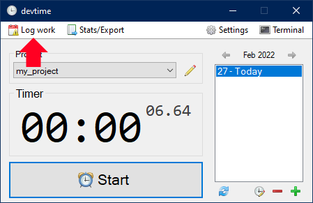

## Navigating the days list

The list shows all the days in a given month. Use the arrows to go to the previous/next month. If you have no logged days for a given month, it will be skipped. The arrows will be disabled or enabled based on if there are logged days in the past or in the future.

  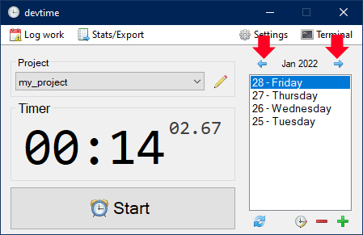

## Manually adding a day

Simply click the `+` icon.

  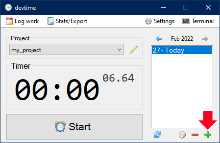

  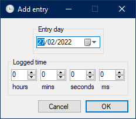

You can manually delete a day by clicking on the `-` icon.

## Changing the logged time for a day

Simply click the small watch icon. You will be able to change the logged time.

  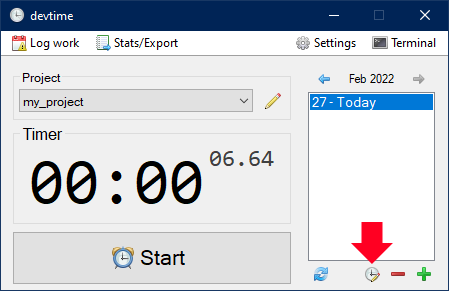

## Refreshing everything

You can force devtime to read the database again by clicking on the *refresh* icon.

  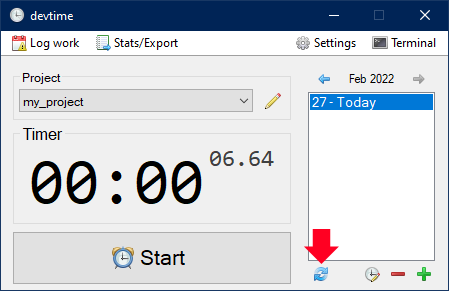

## Stats

  

### Exporting to CSV/JSON

Select your desired format. You can also choose which fields to add in the exported file: `date`, `logged time`, and `log` (from *Log Work*). You will be prompted to choose a file where to export the data.

  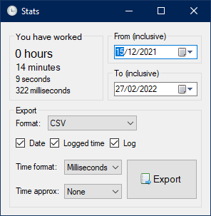

Dates have the format `yyyy-MM-dd`. You can choose a custom format for the time. You may also approximate the time either via `Round` or `Ceiling`. For example, to get an estimate of how many hours you worked each day, use the `Hours` format and `Round` approximation.

## Settings

You can change various options via the settings menu. All of them are labeled using tooltips. The settings are saved in `devtime.ini` near the exe file.

  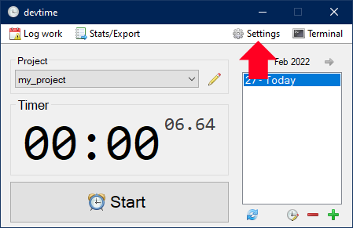

  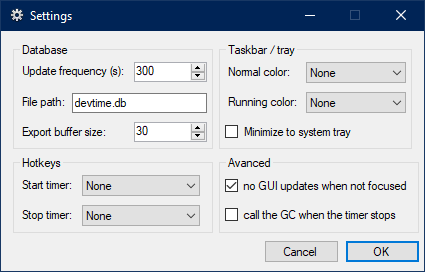

### Database

|        Name        |                                                                                      Description                                                                                      |   Default  |
|:------------------:|:-------------------------------------------------------------------------------------------------------------------------------------------------------------------------------------:|:----------:|
| Update frequency   | When the timer is running, once how many seconds to save the time to the database                                                                                                     |     300    |
| File path          | The database file path                                                                                                                                                                | devtime.db |
| Export buffer size | How many entries to export at a time (i.e. the size of the buffer between the database and the export file). The higher it is, the faster the export, but the more memory it consumes |     30     |

### Taskbar/Tray

|           Name          |                                                                     Description                                                                    | Default |
|:-----------------------:|:--------------------------------------------------------------------------------------------------------------------------------------------------:|:-------:|
| Normal color            | What color the taskbar icon should have when the timer isn't running                                                                               |   None  |
| Running color           | Same as above but when the timer is running                                                                                                        |   None  |
| Minimize to system tray | When minimizing the window, spawn a tray icon. This icon also inherits the colors from the taskbar. Double click on the icon to restore the window |  False  |

### Hotkeys

|     Name    |             Description            | Default |
|:-----------:|:----------------------------------:|:-------:|
| Start timer | The hotkey used to start the timer |   None  |
| Stop timer  | The hotkey used to stop the timer  |   None  |

The function keys and the media play/pause key are supported. You can bind one of your mouse buttons to media play/pause, and be able to control devtime like that.

### Advanced

|               Name               |                                                      Description                                                     | Default |
|:--------------------------------:|:--------------------------------------------------------------------------------------------------------------------:|:-------:|
| no GUI updates when not focused  | Don't update the GUI when the window doesn't have focus, in order to lower the CPU usage                             |   True  |
| call the GC when the timer stops | Force the CLR garbage collector to run every time the timer is stopped, in order to potentially free a bit of memory |  False  |

## Terminal

devtime includes an SQLite3 console. You can use it to run any queries on the database. If you make any changes, you can use the previously mentioned *refresh* button.

  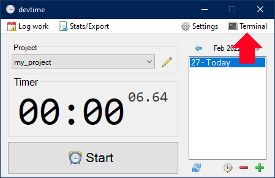

# Building devtime

devtime was developed using Visual Studio 2022 and .Net Framework 4.5 for maximum compatibility.

You will need an SQLite3 DLL present in the same folder as the `.sln` file. It will be automatically copied to the output folder. If it's not copied for some reason, manually copy it in the same folder as `devtime.exe`.

devtime was officially tested with SQLite `3.37.2`. Any other SQLite3 version should work fine, but they aren't guaranteed to.

# License 

devtime was created by [The Exom Developers](https://github.com/exom-dev). It is licensed under the [MIT](https://github.com/exom-dev/devtime/blob/master/LICENSE) license.

## Dependencies and assets

- [Fugue Icons](https://p.yusukekamiyamane.com/): [Yusuke Kamiyamane](https://yusukekamiyamane.com/) ([Creative Commons Attribution 3.0 License])
- [SQLite 3](https://www.sqlite.org/): [SQLite developers](https://www.sqlite.org/crew.html) ([Public Domain](https://www.sqlite.org/copyright.html))
- [SQLite Sharp](https://github.com/UnexomWid/sqlite-sharp): [UnexomWid](https://github.com/UnexomWid) ([MIT License](https://github.com/UnexomWid/sqlite-sharp/blob/master/LICENSE))